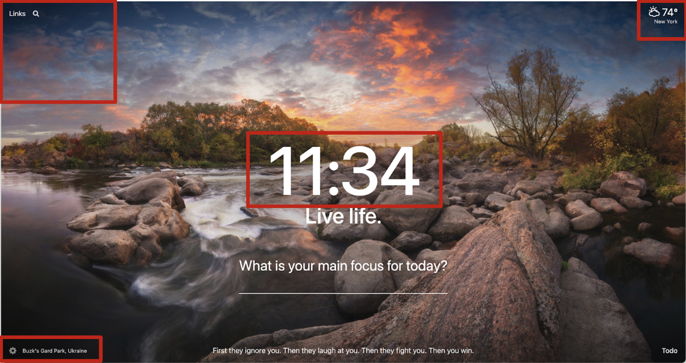

### Personal Dashboard Capstone Project.

- This capstone project has been turned to chrome extension and deployed to the personal browser so when new tab is open we can see that personal dashboard displaying.
- It is a real chrome extension mimicking the momentum dashboard which acts as a productivity tool replacing new tab page with personal dashboard featuring todo, weather, and inspiration.

In this version of momentum it pops up an informational screen whenever open a new tab in a browser. It takes over the default tab and replaces it with personal dashboard featuring,

- Current time
- List of cryptocurrencies
- Weather
- Background image, and info about the author.

* Interacted with as many as possible APIs.

### WIREFRAME

### To consider:

Schema:

- Get a random image from Unsplash and set it as the background
- Layout the content of the page

* Allow Google Chrome access to Location and Services of your computer.
